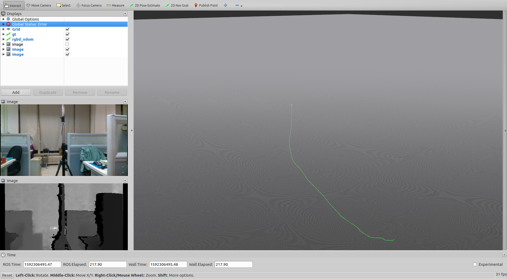

## Getting Started
These instructions will get you a copy of the project up and running on your local machine for development and testing purposes.

## Prerequisites
* Ubuntu 16.04 and later
* ROS kinetic and later
* Eigen 3.3.0 and later
* OpenCV 3.3 and later

## Installing
* git clone https://github.com/mrsp/rgbd_odom_ros.git
* catkin_make

## Launch 
* Specify configuration parameters in a yaml file e.g. in config/xtion.yaml
* roslaunch roslaunch rgbd_odom_ros rgbd_odom_ros.launch

## Example of RGBD Odometry computed in the [OpenLoris Dataset office 1.1](https://lifelong-robotic-vision.github.io/dataset/Data_Object-Recognition.html)

  

